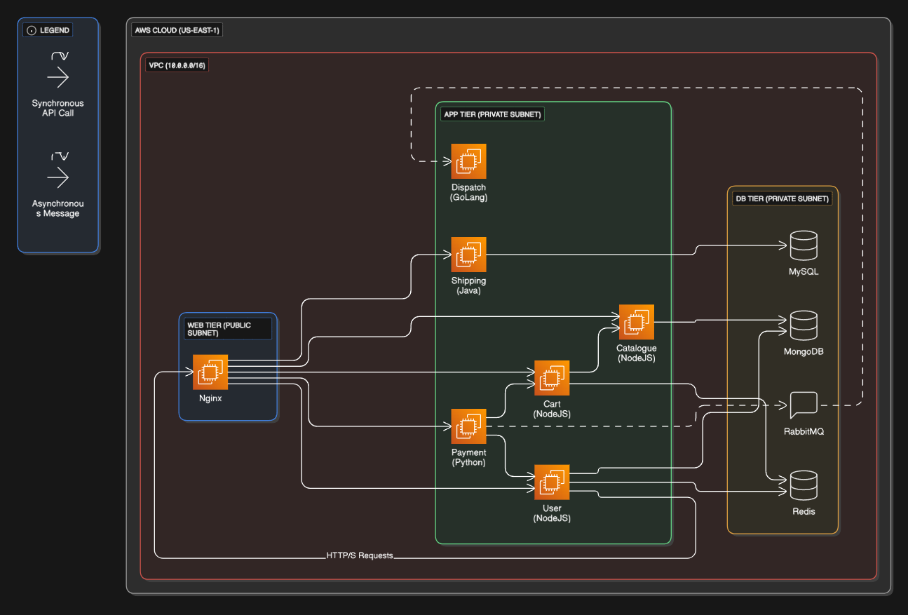

# Project: End-to-End Deployment & Automation of RoboShop on AWS

This portfolio project showcases the end-to-end process of deploying a complex microservices application (RoboShop) onto the AWS cloud. The project is broken down into multiple phases to demonstrate a realistic progression from foundational manual processes to repeatable, robust automation.

*   **Phase 1: Manual Deployment Runbooks** - Detailed, step-by-step documentation for every component.
*   **Phase 2: Scripted Automation** - Professional, robust shell scripts to automate the manual steps.

---

## System Architecture

The application is deployed using a classic **Three-Tier Architecture**. This design separates concerns into distinct layers, which enhances security, simplifies maintenance, and allows each tier to be scaled independently.

The custom diagram below illustrates the flow of communication between the components as implemented in this project.

<!-- This relative path points to the image inside your 'assets' folder -->

*   **Presentation Tier (Frontend):** A public-facing Nginx server that serves static content and acts as a secure reverse proxy for all backend services.
*   **Application Tier (Backend):** A set of protected microservices running in a private network, each handling specific business logic (e.g., Catalogue, User, Cart).
*   **Persistence Tier (Data):** A collection of databases, caches, and message brokers, also in a private network, to manage all application data (e.g., MongoDB, Redis, MySQL).

---

## Technology Stack

| Category                  | Technologies                                      |
|---------------------------|---------------------------------------------------|
| **Cloud Provider**        | Amazon Web Services (AWS)                         |
| **Compute & Networking**  | EC2, VPC, Subnets, Security Groups, Route 53      |
| **Web Server**            | Nginx                                             |
| **Application Runtimes**  | NodeJS, Java                                      |
| **Databases & Caches**    | MongoDB, MySQL, Redis                             |
| **Automation**            | **Bash/Shell Scripting**                          |
| **Deployment Tools**      | `systemd`, `dnf` (yum), `npm`, `maven`            |

---

## Phase 1: Manual Deployment Runbooks

This phase establishes the foundational knowledge required for any automation. Each file below is a detailed, step-by-step guide for manually deploying and configuring a specific component of the RoboShop application.

*   [✔️ 01 - Frontend (Nginx)](./01-Frontend.md)
*   [✔️ 02 - MongoDB](./02-MongoDB.md)
*   [✔️ 03 - Catalogue Service](./03-Catalogue.md)
*   [✔️ 04 - Redis](./04-Redis.md)
*   [✔️ 05 - User Service](./05-User.md)
*   [✔️ 06 - Cart Service](./06-Cart.md)
*   [✔️ 07 - MySQL](./07-MySQL.md)
*   [✔️ 08 - Shipping Service](./08-Shipping.md)
*   [✔️ 09 - Payment Service](./09-Payment.md)

---

## Phase 2: Scripted Automation (`/scripts`)

This phase demonstrates the first level of automation. The manual commands from the runbooks have been refactored into robust, idempotent, and reusable shell scripts located in the [`scripts/`](./scripts/) directory. These scripts include error handling, user feedback, and use arguments for flexible deployment.

*   [**Browse all Automation Scripts →**](./scripts/)

**Example Scripts:**
*   [`scripts/mongodb.sh`](./scripts/mongodb.sh): Automates the complete setup of the MongoDB server.
*   [`scripts/catalogue.sh`](./scripts/catalogue.sh): Automates the Catalogue service setup and requires the MongoDB host IP as an argument to remain flexible.
*   *...and so on for all other services.*

---

## Project Learning Objectives

Through this project, I am developing and demonstrating proficiency in:

-   [x] Cloud infrastructure design and manual provisioning on AWS.
-   [x] Configuring network security (VPCs, Public/Private Subnets, Security Groups).
-   [x] Deploying and managing Linux-based web servers and reverse proxies (Nginx).
-   [x] Manually deploying polyglot microservices (NodeJS, Java).
-   [x] Writing professional, reusable automation scripts with Bash.
-   [x] Creating high-quality technical documentation for operational procedures.

---

## Future Roadmap

This project is designed to evolve. The subsequent phases will build upon the current foundation:

*   **Phase 3: Configuration Management with Ansible:** Abstract the deployment logic further using Ansible playbooks for a more powerful and declarative automation approach.
*   **Phase 4: Infrastructure as Code (IaC) with Terraform:** Fully automate the creation of the underlying AWS infrastructure.
*   **Phase 5: Continuous Integration (CI/CD) with Jenkins:** Create a CI/CD pipeline to orchestrate the entire deployment process, from code commit to a running application.